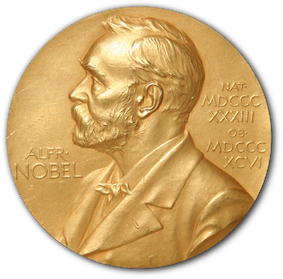

# 🏅 Nobel Prize Investigation

Exploratory analysis of over 100 years of Nobel Prize data (1901–2023), looking for patterns in gender, nationality, and repeat laureates.

## Context

The Nobel Prize is one of the most prestigious awards in the world, given annually across six categories (Chemistry, Literature, Medicine, Peace, Physics, and Economics). This project explores the official Nobel Prize API dataset to answer concrete questions about who has historically received the prize — and how that has shifted over the century.

## Dataset

- **Source:** [Nobel Prize API](https://www.nobelprize.org/about/developer-zone-2/) — `nobel.csv`
- **Period:** 1901 to 2023
- **Content:** individual laureates and organizations, with birth/death info, category, and prize motivation

## Methodology

- Aggregation and frequency counts (`value_counts`, `groupby`)
- Created a decade column to analyze trends over time
- Calculated proportions and ratios (e.g., US-born winners per decade, share of female laureates per decade/category)
- Visualizations with `seaborn` (bar and line plots)

## Key Findings

- 🌍 **Most awarded country:** the United States is the most common birth country among laureates; male laureates heavily outnumber female ones overall.
- 📈 **Peak US decade:** the **2000s** had the highest ratio of US-born winners to total winners for that decade (**42.3%**).
- 👩‍🔬 **Highest female share:** three decade/category combinations tied at 50% female laureates — **Peace (2010s)**, **Literature (2020s)**, and **Peace (2020s)**.
- 🥇 **First woman laureate:** **Marie Curie** (née Sklodowska), in **Physics**, 1903.
- 🔁 **Repeat winners** (more than one Nobel): Marie Curie, Linus Pauling, John Bardeen, Frederick Sanger, the International Committee of the Red Cross, and UNHCR.

## Tech Stack

`pandas` · `numpy` · `seaborn` · `matplotlib`
